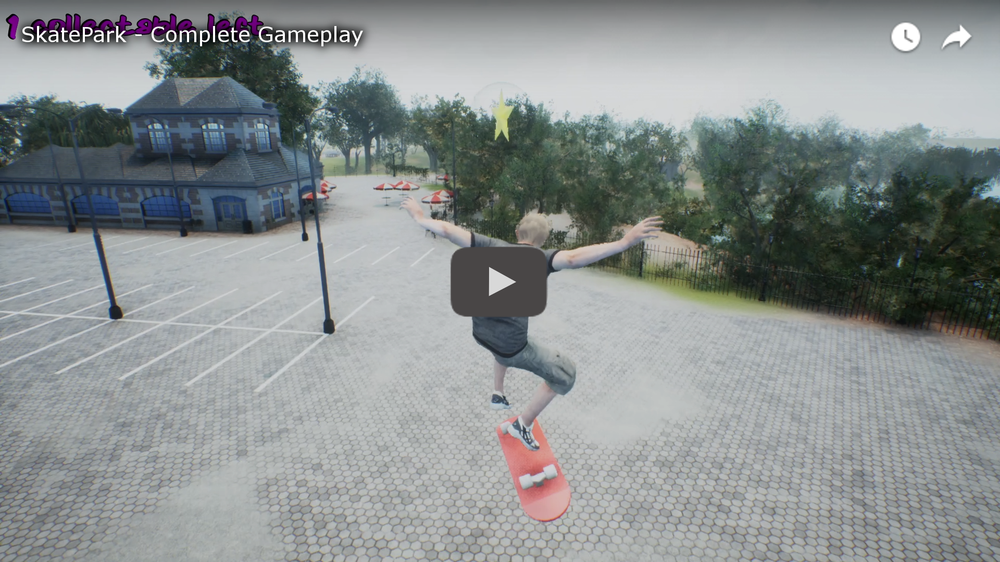

# Skate Park

### First implementation of the character
The first 4 hours of development. In that time I've implemented:
* Added a generic map from unreal marketplace (optmized to be uploaded here in GitHub)
* Added Core classes, including GameMode, PlayerController and Character
* Character uses a generic 3D model from Mixamo
* Added AnimationBlueprint with a simple Mixamo idle animation
* Added Enhanced Input System
* Added camera control with the mouse
* Added an impulse when you press up

### Copa America night update! 
These past 6 hours I've been struggling a lot with Mixamo's animation root motion. I had to edit the animations in Blender to add the root bone, and when I solved the movement, a new and worse enemy appeared: the skateboard.

The solution: add the skateboard mesh as part of the character and a new dedicated bone, all in Blender, thus modifying both the Skeletal Mesh and each of the animations. Now the default Mixamo animations no longer work, so I have to add and edit them from my Blender project, and I also have to animate the skateboard.

I should clarify that although I have experience in Blender, animations are something I always avoided doing and therefore never learned. Today I needed it and learned something new. Fortunately, I know the tool well enough to move forward with a bit of creativity.

### Wednesday night update:
Today I added about 4 to 5 hours of work... in that time:
* I moved all the logic to C++. For now, it's just a class that inherits from Character.
* I added the CustomEditor module to facilitate variable search tasks.
* I battled against a corrupt Blueprint and fixed it by installing BPCorruptionFix.
* I significantly improved the steering. It still feels quite stiff, but it’s much more natural than before.
* Bug fixed: Rotating the camera no longer alters the direction in which the character moves.
* I removed collisions from bushes that were just getting in the way.

### Thursday night update:
Today I added about 5 hours of work just designing the level. I thought it would take less time, but there's a lot of trial and error involved.

### Finally Friday! Last night!

Today I finished this technical assessment. I logged about 7 hours, during which time:
* I added the collectables and scattered them across the map
* Implemented the braking mechanic
* Enhanced maneuverability and fixed some bugs that caused the character to get stuck in different parts of the map
* Improved collisions with the environment
* And the cherry on top: Added the Backflip as a mechanic to step backwards.
* I also spent time creating the technical assessment report document

You can watch a video of the final result of this technical assessment:

### 📞 Contact
If you have any questions, feel free to reach out to me.
* My email is <lorenzon.cesar@hotmail.com>
* LinkedIn, Discord, YouTube channel and more on [my LinkTree](https://linktr.ee/lorenzoncesar). 

*César Javier Lorenzon, Game Developer*.

### Now, time to rest! 😴